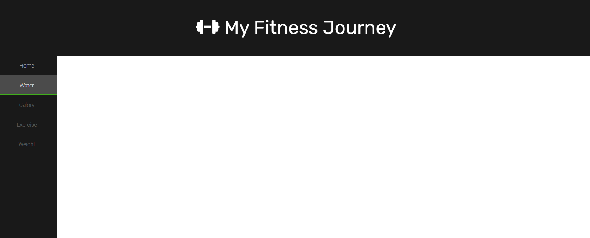

# My Fitness Journey
⚙️ _Under development_

My Fitness Journey is a web app designed to help users track their daily caloric intake, water consumption, exercise routines, and weight progress. Built using Django as a web framework, this app is a simple and intuitive way to keep track of your health and fitness goals.

## Features
- User registration and login.
- Track daily caloric intake
- Track water consumption
- Keep track of your exercise routines
- Log your weight progress
- Get insights into your daily health and fitness habits
- Track your diet and make healthier choices
- Dashboard to view daily, weekly, and monthly progress
- Trend charts to view progress over time
- Goal setting feature to help users set and achieve their health goals
- Admin panel to manage users and their data

## Benefits
My Fitness Journey is an excellent tool for anyone looking to improve their health and fitness. By keeping track of your caloric intake, water consumption, exercise routines, and weight progress, you can make informed decisions about your diet and exercise habits. This can help you lose weight, build muscle, and improve your overall health.

In addition to tracking your daily habits, My Fitness Journey can help you set and achieve your fitness goals. Whether you're looking to lose weight, build muscle, or simply improve your overall health, this app can help you stay on track and make progress over time.

With its intuitive interface and comprehensive tracking features, My Fitness Journey is the perfect tool for anyone looking to improve their health and fitness.

